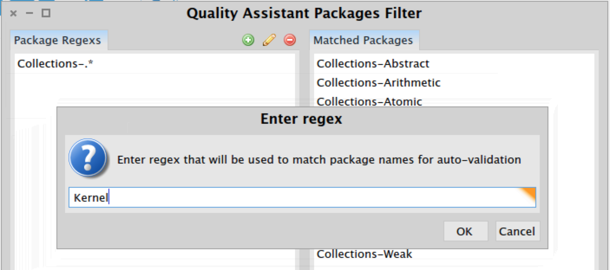
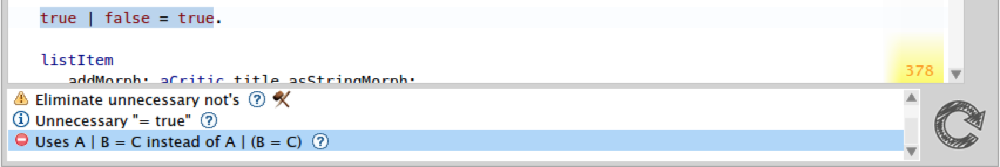

Quality Assistant _`beta`_ [](https://ci.inria.fr/pharo-contribution/job/QualityAssistant/)
=====================

Hi, I'm your personal quality assistant. I run SmallLint rules on the code that you modify, and notify you about the critics right in the system browser. If you find any bugs in me please [report them](https://github.com/Uko/QualityAssistant/issues).


- [Installation](#installation)
- [Set Up](#set-up)
- [Usage](#usage)

Installation
------------

The easiest way to install is to use **Configuration browser**. Otherwise you can execute the following script.

```Smalltalk
Metacello new
  smalltalkhubUser: 'Pharo'
  project: 'MetaRepoForPharo40';
  configuration: 'QualityAssistant';
  load
```

Set Up
------

Select "Quality Assistant" in **World menu**. Add regular expressions that will match the package names which you want to be automatically validated. Then press **Accept**, this will finalize and store the configuration. This setup will be used by Quality Assistant in **all future** images.



Usage
-----

Quality Assistant uses Nautilus plugin to notify uses about the critics. The plugin is automatically activated and will be available in all browsers **opened after** loading Quality Assistant. By default the plugin is positioned at the bottom of Nautilus browser, and will display a list of critics for a selected class or method. Clicking on the question mark will bring up the rationale on the critic. Clicking on the critic text will highlight the part of problematic code (if possible). Sometimes a yellow arrow will appear next to critic description. By pressing it you can automatically resolve the issue.


