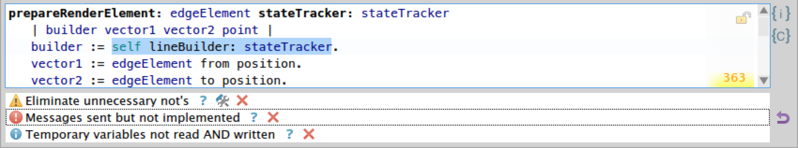

Quality Assistant _`beta`_ [](https://ci.inria.fr/pharo-contribution/job/QualityAssistant/)
=====================

Hi, I'm your personal quality assistant. I run SmallLint rules on the code that you modify, and notify you about the critics right in the system browser. If you find any bugs in me please [report them](https://github.com/Uko/QualityAssistant/issues).


- [Installation](#installation)
- [Usage](#usage)
 - [Critics Details](#critics-details)
- [Story Behind the Name](#story-behind-the-name)

Installation
------------

The easiest way to install is to use **Configuration Browser**. Otherwise you can execute the following script.

```Smalltalk
Metacello new
  smalltalkhubUser: 'Pharo'
  project: 'MetaRepoForPharo40';
  configuration: 'QualityAssistant';
  load
```

Usage
-----

Quality Assistant uses Nautilus plugin to notify users about the critics in their code. The plugin is automatically activated and will be available in all browsers **opened after** loading Quality Assistant. By default the plugin is positioned at the bottom of Nautilus browser, and will display a list of critics for a selected class or method.



###Critics Details
Clicking on the critic text will highlight the part of problematic code (if possible).

####Severity levels
There are 3 severity levels of critics that are displayed at the left side of the list:

*  Information
*  Warning
*  Error

####Actions
 **Rationale**. Clicking on the question mark will bring up the rationale on the critic.

 **Skip**. Allows you to skip validation of the current class or method by the rule of the critic. I.e. the critic will not be reported any more. When skipping a critic for a method, you can decide to skip it on the class level, so the policy will apply to all the methods of a class. _This functionality is implemented on top of Manifest false positives_.

 **Autofix**. Some critics provide a solution to the issue reported by them. By pressing "autofix" button you will open a diff preview of the changes that will happen if you apply the proposed issue resolution.

Story Behind the Name
---------------------

Definitely, the idea behind Quality Assistant is to have a bot that assists you with the qulaity of your code. But there is also the other side of the Moon.

In Ukraine we are used to call quality assurance engineers just QAs. And we are using it so much that we start to decline it in our own language. So you can think about QA as something like _"cuey"_ (Ukr: _"кюей"_). And so it's common to say: _"the QA will check this"_ or _"a QA has found a bug"_ or even _"our QA has a birthday today"_.

In the first prototypes of Quality Assistant there was a global variable `QA` and so you could ask it:

```Smalltalk
QA revalidate: aMethod
```

```Smalltalk
QA criticsOf: aClass
```

This way you have an artificial quality assurance engineer, that you can talk to. And that guy (or girl) knows something about the quality of your code.
